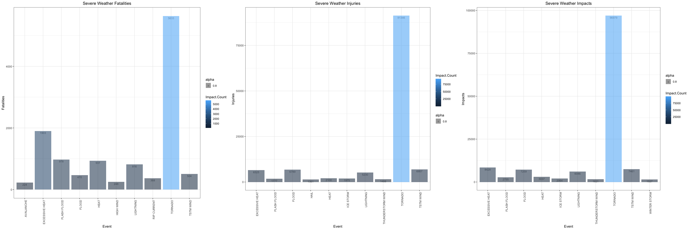
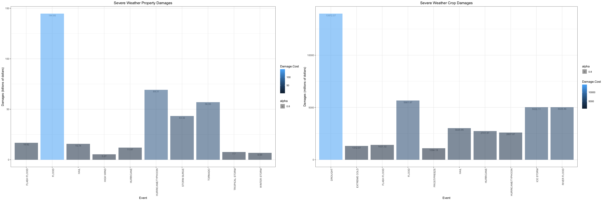

# Bad Weather
Which severe weather events cause the most damage?

## Introduction
Storms and other severe weather events can cause both public health and economic problems for communities and municipalities. Many severe events can result in fatalities, injuries, and property damage, and preventing such outcomes to the extent possible is a key concern.

This project involves exploring the U.S. National Oceanic and Atmospheric Administration's (NOAA) storm database. This database tracks characteristics of major storms and weather events in the United States, including when and where they occur, as well as estimates of any fatalities, injuries, and property damage.

In this project, we want to analyze the effect of the different types of events on population health, specifically to determine which events harm the most people. Additionally, we want to calculate the extent of economic damage caused by each type of event to determine the events with the greatest economic consequences.

## Data Source and Documentation
The data for this assignment come in the form of a comma-separated-value file compressed via the bzip2 algorithm to reduce its size.

* The National Weather Service provides [Storm Data Documentation](https://d396qusza40orc.cloudfront.net/repdata%2Fpeer2_doc%2Fpd01016005curr.pdf).
* The National Climactic Data Center provides some [Storm Events FAQ](https://d396qusza40orc.cloudfront.net/repdata%2Fpeer2_doc%2FNCDC%20Storm%20Events-FAQ%20Page.pdf).

The events in the database start in the year 1950 and end in November 2011. In the earlier years of the database there are generally fewer events recorded, most likely due to a lack of good records. More recent years should be considered more complete.

## Analytic Session Information

```r
library('ggplot2')     ## for plotting
library('dplyr')       ## for its fancy %>% function
library('gridExtra')   ## for paneling the plots
```

Here's `sessionInfo()` for the computer this document was knit on.

```r
sessionInfo()
```

```
## R version 3.5.0 (2018-04-23)
## Platform: x86_64-apple-darwin15.6.0 (64-bit)
## Running under: macOS High Sierra 10.13.3
## 
## Matrix products: default
## BLAS: /Library/Frameworks/R.framework/Versions/3.5/Resources/lib/libRblas.0.dylib
## LAPACK: /Library/Frameworks/R.framework/Versions/3.5/Resources/lib/libRlapack.dylib
## 
## locale:
## [1] en_US.UTF-8/en_US.UTF-8/en_US.UTF-8/C/en_US.UTF-8/en_US.UTF-8
## 
## attached base packages:
## [1] stats     graphics  grDevices utils     datasets  methods   base     
## 
## other attached packages:
## [1] gridExtra_2.3 dplyr_0.7.6   ggplot2_3.0.0
## 
## loaded via a namespace (and not attached):
##  [1] Rcpp_0.12.17     bindr_0.1.1      knitr_1.20       magrittr_1.5    
##  [5] tidyselect_0.2.4 munsell_0.5.0    colorspace_1.3-2 R6_2.2.2        
##  [9] rlang_0.2.1      stringr_1.3.1    plyr_1.8.4       tools_3.5.0     
## [13] grid_3.5.0       gtable_0.2.0     withr_2.1.2      htmltools_0.3.6 
## [17] assertthat_0.2.0 yaml_2.1.19      lazyeval_0.2.1   rprojroot_1.3-2 
## [21] digest_0.6.15    tibble_1.4.2     crayon_1.3.4     bindrcpp_0.2.2  
## [25] purrr_0.2.5      prettydoc_0.2.1  glue_1.2.0       evaluate_0.10.1 
## [29] rmarkdown_1.10   stringi_1.2.3    compiler_3.5.0   pillar_1.3.0    
## [33] scales_0.5.0     backports_1.1.2  pkgconfig_2.0.1
```

## Data Processing

Let's download the data and load it into R.

```r
if (!file.exists("data")) dir.create("data")
if (!file.exists("data/storms.csv.bz2")) download.file("https://d396qusza40orc.cloudfront.net/repdata%2Fdata%2FStormData.csv.bz2", "data/storms.csv.bz2")

storms <- read.csv("data/storms.csv.bz2")
```

Let's convert the date columns from factors to dates.

```r
storms$BGN_DATE <- as.Date(as.character(storms$BGN_DATE), format="%m/%d/%Y %H:%M:%S")
storms$END_DATE <- as.Date(as.character(storms$END_DATE), format="%m/%d/%Y %H:%M:%S")
```

The column names in the original dataset aren't the best.

```r
colnames(storms)
```

```
##  [1] "STATE__"    "BGN_DATE"   "BGN_TIME"   "TIME_ZONE"  "COUNTY"    
##  [6] "COUNTYNAME" "STATE"      "EVTYPE"     "BGN_RANGE"  "BGN_AZI"   
## [11] "BGN_LOCATI" "END_DATE"   "END_TIME"   "COUNTY_END" "COUNTYENDN"
## [16] "END_RANGE"  "END_AZI"    "END_LOCATI" "LENGTH"     "WIDTH"     
## [21] "F"          "MAG"        "FATALITIES" "INJURIES"   "PROPDMG"   
## [26] "PROPDMGEXP" "CROPDMG"    "CROPDMGEXP" "WFO"        "STATEOFFIC"
## [31] "ZONENAMES"  "LATITUDE"   "LONGITUDE"  "LATITUDE_E" "LONGITUDE_"
## [36] "REMARKS"    "REFNUM"
```

Without changing the underlying significance, let's make them human-readable (and more compliant with R standards).

```r
sdnames <- c("State.Code", "Begin.Date", "Begin.Time", "Time.Zone", "Begin.County.Code", "Begin.County.Name", "State.Initials", "Event.Type", "Begin.Range", "Begin.Azimuth", "Begin.Location", "End.Date", "End.Time", "End.County.Code", "End.County.Name", "End.Range", "End.Azimuth", "End.Location", "Length", "Width", "F", "Magnitude", "Fatalities", "Injuries", "Prop.Damage", "Prop.Exp", "Crop.Damage", "Crop.Exp", "Weather.Office", "Office.State", "Zone.Names", "Begin.Latitude", "Begin.Longitude", "End.Latitude", "End.Longitude", "Remarks", "Ref.Number")

colnames(storms) <- sdnames
rm(sdnames)    ## save memory
```

The dataset, specifically in the `Property.Exp`, `Crop.Exp`, and `Event.Type` columns, appears to contain duplicates in various different cases. Additionally, we can collapse the Exp columns by using their values to calculate the numeric Damages.

```r
# Convert the Exp columns to uppercase.
storms$Prop.Exp <- sapply(storms$Prop.Exp, function(x) toupper(as.character(x)))
storms$Crop.Exp <- sapply(storms$Crop.Exp, function(x) toupper(as.character(x)))

# Convert the Exp columns to magnitudes.
# The following are unknown values that we can ignore/collapse to 0.
storms$Prop.Exp[storms$Prop.Exp %in% c('', '+', '-', '?')] <- "0"
storms$Crop.Exp[storms$Crop.Exp %in% c('', '?')] <- '0'

# Let's convert the `h` to 2 (100), `k` to 3 (1,000), `m` to 6 (1,000,000), and `b` to 9 (1,000,000,000)
storms$Prop.Exp[storms$Prop.Exp %in% c('H')] <- '2'
storms$Prop.Exp[storms$Prop.Exp %in% c('K')] <- '3'
storms$Prop.Exp[storms$Prop.Exp %in% c('M')] <- '6'
storms$Prop.Exp[storms$Prop.Exp %in% c('B')] <- '9'

# There are no `h` values in Crop.Exp.
storms$Crop.Exp[storms$Crop.Exp %in% c('K')] <- '3'
storms$Crop.Exp[storms$Crop.Exp %in% c('M')] <- '6'
storms$Crop.Exp[storms$Crop.Exp %in% c('B')] <- '9'

# Multiply the Damage columns by the appropriate power of 10.
storms$Prop.Damage = as.numeric(storms$Prop.Damage) * (10 ^ (as.numeric(storms$Prop.Exp)))
storms$Crop.Damage = as.numeric(storms$Crop.Damage) * (10 ^ (as.numeric(storms$Crop.Exp)))

# Finally, for the sake of memory, let's get rid of the now-useless Exp columns.
storms$Prop.Exp <- NULL
storms$Crop.Exp <- NULL
```

The `Event.Type` column also features some duplicates in different casing, so let's take care of that too.

```r
# Let's uppercase everything.
storms$Event.Type <- sapply(storms$Event.Type, function(x) toupper(as.character(x)))
```

To check that our data is intact, let's head off a few rows where the `Begin.Date` is past Jan. 01, 2001.

```r
head(storms[storms$Begin.Date > "2001-01-01", -34])    ## Ignore the Remarks column for now.
```

```
##        State.Code Begin.Date  Begin.Time Time.Zone Begin.County.Code
## 413286          1 2001-02-25 01:00:00 AM       CST               133
## 413287          1 2001-02-25 01:15:00 AM       CST                91
## 413288          1 2001-02-27 04:40:00 PM       CST                99
## 413289          1 2001-02-27 04:45:00 PM       CST                99
## 413290          1 2001-02-27 04:50:00 PM       CST                35
## 413291          1 2001-03-02 03:15:00 PM       CST                23
##        Begin.County.Name State.Initials Event.Type Begin.Range
## 413286           WINSTON             AL  TSTM WIND           0
## 413287           MARENGO             AL  TSTM WIND           0
## 413288            MONROE             AL       HAIL           0
## 413289            MONROE             AL  TSTM WIND           7
## 413290           CONECUH             AL  TSTM WIND           0
## 413291           CHOCTAW             AL  TSTM WIND           0
##        Begin.Azimuth Begin.Location   End.Date    End.Time End.County.Code
## 413286                      ADDISON 2001-02-25 01:00:00 AM               0
## 413287                  SWEET WATER 2001-02-25 01:20:00 AM               0
## 413288                     PETERMAN 2001-02-27 04:45:00 PM               0
## 413289            NE       PETERMAN 2001-02-27 04:50:00 PM               0
## 413290                     NICHBURG 2001-02-27 04:55:00 PM               0
## 413291                        TOXEY 2001-03-02 03:20:00 PM               0
##        End.County.Name End.Range End.Azimuth End.Location Length Width  F
## 413286              NA         0                  ADDISON      0     0 NA
## 413287              NA         0              SWEET WATER      0     0 NA
## 413288              NA         0                 PETERMAN      0     0 NA
## 413289              NA         7          NE     PETERMAN      0     0 NA
## 413290              NA         0                 NICHBURG      0     0 NA
## 413291              NA         0                    TOXEY      0     0 NA
##        Magnitude Fatalities Injuries Prop.Damage Crop.Damage
## 413286        50          0        0        2000           0
## 413287        75          0        0       15000           0
## 413288        88          0        0           0           0
## 413289        55          0        0        5000           0
## 413290        55          0        0        5000           0
## 413291        55          0        0        3000           0
##        Weather.Office       Office.State Zone.Names Begin.Latitude
## 413286            BMX   ALABAMA, Central                      3412
## 413287            MOB ALABAMA, Southwest                      3206
## 413288            MOB ALABAMA, Southwest                      3135
## 413289            MOB ALABAMA, Southwest                      3139
## 413290            MOB ALABAMA, Southwest                      3129
## 413291            MOB ALABAMA, Southwest                      3154
##        Begin.Longitude End.Latitude End.Longitude Ref.Number
## 413286            8711         3412          8711     413687
## 413287            8752         3206          8752     413688
## 413288            8716         3135          8716     413689
## 413289            8711         3139          8711     413690
## 413290            8708         3129          8708     413691
## 413291            8818         3154          8818     413692
```

Our data is now ready for analysis.

## The Detriment of Population Health by Different Events

For this analysis, we want to explore the injuries and fatalities for the different events. However, there are 898 different events, so we'll only plot the top 10.


```r
impacts.fatal <- aggregate(Fatalities ~ Event.Type, storms, sum)
impacts.injury <- aggregate(Injuries ~ Event.Type, storms, sum)
impacts.all <- aggregate(Fatalities + Injuries ~ Event.Type, storms, sum)

colnames(impacts.fatal) <- c("Event.Type", "Impact.Count")
colnames(impacts.injury) <- c("Event.Type", "Impact.Count")
colnames(impacts.all) <- c("Event.Type", "Impact.Count")

impacts.fatal.ten <- filter(impacts.fatal[order( - as.numeric(impacts.fatal$Impact.Count)),],
                          Impact.Count > 1) %>% top_n(10)
impacts.injury.ten <- filter(impacts.injury[order( - as.numeric(impacts.injury$Impact.Count)),],
                          Impact.Count > 1) %>% top_n(10)

impacts.all.ten <- filter(impacts.all[order( - as.numeric(impacts.all$Impact.Count)),],
                          Impact.Count > 1) %>% top_n(10)
```

Now that our data is organized, let's get plotting. We'll create one figure with all three plots.

```r
fatal.plot <- ggplot(data = impacts.fatal.ten, 
                      aes(x = impacts.fatal.ten$Event.Type, y = impacts.fatal.ten$Impact.Count, fill = `Impact.Count`, alpha = 0.8)) + 
  theme_bw() + geom_text(aes(label = `Impact.Count`), vjust = 1.5, color = "black", position = position_dodge(0.9), size = 3) + 
  geom_bar(stat = "identity") + xlab("Event") + ylab("Fatalities") + ggtitle("Severe Weather Fatalities") + 
  theme(axis.text.x = element_text(angle = 90, hjust = 1)) + theme(plot.title = element_text(hjust = 0.5))

injury.plot <- ggplot(data = impacts.injury.ten, 
                      aes(x = impacts.injury.ten$Event.Type, y = impacts.injury.ten$Impact.Count, fill = `Impact.Count`, alpha = 0.8)) + 
  theme_bw() + geom_text(aes(label = `Impact.Count`), vjust = 1.5, color = "black", position = position_dodge(0.9), size = 3) + 
  geom_bar(stat = "identity") + xlab("Event") + ylab("Injuries") + ggtitle("Severe Weather Injuries") + 
  theme(axis.text.x = element_text(angle = 90, hjust = 1)) + theme(plot.title = element_text(hjust = 0.5))

all.plot <- ggplot(data = impacts.all.ten, 
                      aes(x = impacts.all.ten$Event.Type, y = impacts.all.ten$Impact.Count, fill = `Impact.Count`, alpha = 0.8)) + 
  theme_bw() + geom_text(aes(label = `Impact.Count`), vjust = 1.5, color = "black", position = position_dodge(0.9), size = 3) + 
  geom_bar(stat = "identity") + xlab("Event") + ylab("Impacts") + ggtitle("Severe Weather Impacts") + 
  theme(axis.text.x = element_text(angle = 90, hjust = 1)) + theme(plot.title = element_text(hjust = 0.5))

grid.arrange(fatal.plot, injury.plot, all.plot, ncol = 3)
```

<!-- -->

Looking at the graphs, despite the difference in scaling, the obvious winner here is tornado. The peak is far taller than any of the other top 10 events in terms of injuries, fatalities, and a combination of both. A staggering number of people die or are otherwise harmed by tornadoes, even if we look at the fact that this is a sum of all events over almost 61 years.


## The Economic Damage by Different Events

For this analysis, we want to explore the property and crop damages for the different events. However, there are 898 different events, so we'll only plot the top 10. While the rest of the process is similar to the one above, the difference is that the combined plot makes no sense here (property damage + crop damage). Additionally, the scales are fairly different on the property and crop damage, so we'll skip the combined graph.


```r
damage.prop <- aggregate(Prop.Damage ~ Event.Type, storms, sum)
damage.crop <- aggregate(Crop.Damage ~ Event.Type, storms, sum)

colnames(damage.prop) <- c("Event.Type", "Damage.Cost")
colnames(damage.crop) <- c("Event.Type", "Damage.Cost")

damage.prop.ten <- filter(damage.prop[order( - as.numeric(damage.prop$Damage.Cost)),],
                          Damage.Cost > 1) %>% top_n(10)
damage.crop.ten <- filter(damage.crop[order( - as.numeric(damage.crop$Damage.Cost)),],
                          Damage.Cost > 1) %>% top_n(10)

damage.prop.ten$Damage.Cost <- round(damage.prop.ten$Damage.Cost / 1000000000, 2)
damage.crop.ten$Damage.Cost <- round(damage.crop.ten$Damage.Cost / 1000000, 2)
```

Now that our data is organized, let's get plotting. We'll create one figure with both plots.

```r
prop.plot <- ggplot(data = damage.prop.ten, 
                      aes(x = damage.prop.ten$Event.Type, y = damage.prop.ten$Damage.Cost, fill = `Damage.Cost`, alpha = 0.8)) + 
  theme_bw() + geom_text(aes(label = `Damage.Cost`), vjust = 1.5, color = "black", position = position_dodge(0.9), size = 3) + 
  geom_bar(stat = "identity") + xlab("Event") + ylab("Damages (billions of dollars)") + ggtitle("Severe Weather Property Damages") + 
  theme(axis.text.x = element_text(angle = 90, hjust = 1)) + theme(plot.title = element_text(hjust = 0.5))

crop.plot <- ggplot(data = damage.crop.ten, 
                      aes(x = damage.crop.ten$Event.Type, y = damage.crop.ten$Damage.Cost, fill = `Damage.Cost`, alpha = 0.8)) + 
  theme_bw() + geom_text(aes(label = `Damage.Cost`), vjust = 1.5, color = "black", position = position_dodge(0.9), size = 3) + 
  geom_bar(stat = "identity") + xlab("Event") + ylab("Damages (millions of dollars)") + ggtitle("Severe Weather Crop Damages") + 
  theme(axis.text.x = element_text(angle = 90, hjust = 1)) + theme(plot.title = element_text(hjust = 0.5))

grid.arrange(prop.plot, crop.plot, ncol = 2)
```

<!-- -->

Looking at the property damage plot, we see that floods cause the most destruction. This makes sense, as flood water can make its way through anything with the kind of pressure it has, so it's bound to cause havoc. Additionally, the second highest peak is that of hurricanes, which also makes sense as the gusts of wind often attain such high speeds as to completely rip buildings away from their roots.

Even without looking at the crop damage plot, one would expect the most damage to come from water-related events. The data proves this to be true -- droughts cause the most crop damage (crops die from lack of water), and floods cause the second highest crop damage (land crops don't usually have underwater breathing mechanisms).


## Results and Conclusions
Our analysis of the NOAA storm data gave fairly common-sense results. The most lives were affected by tornados, which can easily suck people in, never to be seen again. The most property was damaged by floods, which can run over entire homes in the worst cases. Finally, the most crop damage was caused by droughts, as farmers can't get enough water to their crops to keep them alive. For these reasons, it is important to ensure that ample data is collected in order to increase the chances of successfully predicting these events, so that precautions may be taken well in time to avoid their devastating results.

### Issues
This analysis was conducted whilst ignoring the fact that some of the data contains ambiguous event types that match others (wind and wnd, etc.). Fixing these issues and reconducting the analysis may lead to different results, but the computer on which the analysis was conducted was not the best when it came to memory, so these steps were skipped for the time being.

If you jumped down here for quick grading, the plots are actually presented above in their appropriate sections.
